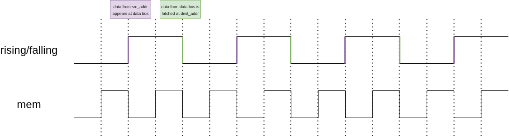

# TTA-CPU
Transport Triggered Architecture cores generator

`python3 generate_fu.py -d directory --config_file` generates template files for functional units implementation. 
Based on config_file (default config.json) file it produces directory `fu` with files `FUname.py` (where FUName corresponds to `name` field of fu in configuration file). 
It also produces a `config_detail.json` which contains detailed core configuration with fu's addresses and instruction elements length computed.
Many instances of a functional unit can be added by simply add a field `instances` in the configuration file. 
Example usage:
```
{
    "name": "Adder",
    "instances": 3,
    "inputs": 2,
    "outputs": 1,
    "inouts": 0,
    "description": "Adds the operands."
},
```
3 instances of Adder will be created and named `Adder`, `Adder1` and `Adder2`.

IP Cores (not being Functional Units) implementations can be placed in directory `ip` in the same superdirectory as `fu`. The implemented module has to be registered in
`IP_REGISTRY` what can be done by calling `core.registry.register_ip(IP_CORE)` below the class implementation. Registered IP Cores are loaded while main core generation.
Functional Units can instantiate IP Cores by calling `core.registry.IP_REGISTRY["IP_Core_name"]`.
Example of usage:
    - [IP Core implementation](examples/example_core/ip/uart.py)
    - [IP Core instantiation](examples/example_core/fu/UART.py)

`python3 synthesize.py` synthesizes core with configuration provided with `-d` flag followed by the path to directory containing functional units implementations.
Detailed information about script usage can be got by running it with `-h` flag.

There are 2 clocks available in the design, actions take place on edges of those two clocks. Slower clock controls instructions and data flow 
(domains `rising` and `falling`) while the second, 2 times faster, is used to access memory (domain `mem`).
Data appears on the data bus on the `rising` edge and is catched by destination unit's registers on the `falling` edge.
In the classical approach functional units operations should be performed and instructions should appear on the instruction bus on the `falling` clock edge.
Phase between `rising`/`falling` clock and `mem` clock is shown at the figure below.



To read instruction memory, the unit called `Fetcher` has to be defined. It can operate on memory using ports `instr_read_ports[0:instruction_memory_read_ports-1]` already defined in the generated file (`instruction_memory_read_ports` is defined in config file by user).
To access data memory, the unit called `DataMemory` has to be defined. It can operate on memory using ports: `data_read_port` and `data_write_port` already defined in the generated file.

To insert firmware into core it first must be translated to json format. Translation can be achieved using `translator.py` script.
Example usage:
`PYTHONPATH=. python3 scripts/translator.py -m "python2json" -d "examples/example_core/" --source-file "examples/example_core/tests/asm/handlers.py"  --target-file="examples/example_core/programs/wandering_led_program.json" -f "wandering_led"`
Program in json format can be passed as an argument to the script `synthesize.py`.
Example usage:
`PYTHONPATH=. python3 scripts/synthesize.py --config-directory="examples/example_core/" -v --init-instr-memory="examples/example_core/program.json" -f`