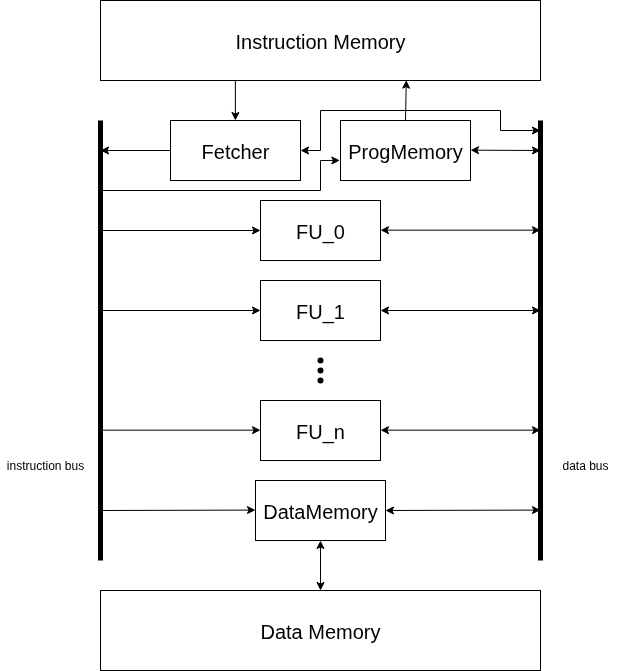

# TTA-CPU
### Transport Triggered Architecture Cores Generator

TTA is a One-Instruction Set Computer (OISC) architecture, where `MOVE` is the only available processor instruction, and all operations occur as a side effect of data transport. 

This project is an implementation of a single-cycle TTA core generator, with the architectural schematic illustrated in the figure below:



A description of the desired core configuration should be placed in a `config.json` file. Template files for the functional unit implementations can be generated using the [attached script](scripts/generate_fu.py) (instructions below). All connections between the units will be automatically generated during synthesis.

An example of a core implementation can be found in the [examples](examples) directory.

#### Generating Functional Units
`python3 generate_fu.py -d directory --config_file` generates template files for functional unit implementations. Based on the `config_file` (default: `config.json`), it produces a `fu` directory containing `FUName.py` files (where `FUName` corresponds to the `name` field in the configuration file). 
It also produces a `config_detail.json` file, which contains the detailed core configuration, including computed functional unit addresses and instruction bit-widths.
Multiple instances of a functional unit can be added by simply adding an `instances` field in the configuration file:
```json
{
    "name": "Adder",
    "instances": 3,
    "inputs": 2,
    "outputs": 1,
    "inouts": 0,
    "description": "Adds the operands."
}
```
3 instances of Adder will be created and named `Adder`, `Adder1` and `Adder2`.

#### IP Cores
IP Cores (not being Functional Units) implementations can be placed in directory `ip` in the same parent directory as `fu`. The implemented module has to be registered in
`IP_REGISTRY` what can be done by calling `core.registry.register_ip(IP_CORE)` below the class implementation. Registered IP Cores are loaded while main core generation.
Functional Units can instantiate IP Cores by calling `core.registry.IP_REGISTRY["IP_Core_name"]`.
Example of usage:
    - [IP Core implementation](examples/example_core/ip/uart.py)
    - [IP Core instantiation](examples/example_core/fu/UART.py)

#### Synthesis
`python3 synthesize.py` synthesizes core with configuration provided with `-d` flag followed by the path to directory containing functional units implementations.
Detailed information about script usage can be got by running it with `-h` flag.

#### Clock Domains and data flow
There are 2 clocks available in the design, actions take place on edges of those two clocks. Slower clock controls instructions and data flow 
(domains `rising` and `falling`) while the second, 2 times faster, is used to access memory (domain `mem`).
Data appears on the data bus on the `rising` edge and is caught by destination unit's registers on the `falling` edge.
In the classical approach functional units operations should be performed and instructions should appear on the instruction bus on the `falling` clock edge.
Phase between `rising`/`falling` clock and `mem` clock is shown at the figure below.


#### Memory access units
- To read instruction memory, the unit called `Fetcher` has to be defined. It can operate on memory using ports `instr_read_ports[0:instruction_memory_read_ports-1]` already defined in the generated file (`instruction_memory_read_ports` is defined in configuration file by user).
- To access data memory, the unit called `DataMemory` has to be defined. It can operate on memory using ports: `data_read_port` and `data_write_port` already defined in the generated file.
- To modify instruction memory, the unit called `ProgMemory` has to be defined. It can operate on memory using `instr_write_port` already defined in the generated file.

#### Firmware and translation
To insert firmware into core it first must be translated to json format. Translation can be achieved using `translator.py` script.
Example usage:
`PYTHONPATH=. python3 scripts/translator.py -m "python2json" -d "examples/example_core/" --source-file "examples/example_core/tests/asm/handlers.py"  --target-file="examples/example_core/programs/wandering_led_program.json" -f "wandering_led"`
Program in json format can be passed as an argument to the script `synthesize.py`.
Example usage:
`PYTHONPATH=. python3 scripts/synthesize.py --config-directory="examples/example_core/" -v --init-instr-memory="examples/example_core/bootloader/bootloaderUART.json" --init-data-memory="examples/example_core/bootloader/bootloader_data.json" -f`

#### Uploading programs via UART
To send a program to `example_core` running bootloader script `sendUART.py` can be used. Program to upload should be previously translated into data (losing structure constant, src_addr, dst_addr) **with a proper offset** not less than 140. It can be done in single step by running `translator.py` with mode `python2data_json`.
Example usage:
`PYTHONPATH=. python3 scripts/translator.py -m "python2data_json" --source-file "examples/example_core/tests/asm/handlers.py"  --target-file="examples/example_core/programs/wandering_led_translated_program.json" -f "wandering_led" -o 150`
`PYTHONPATH=. python3 scripts/sendUART.py -m "program" -s "examples/example_core/programs/wandering_led_translated_program.json" -l --offset 150 --baud-rate 115200`